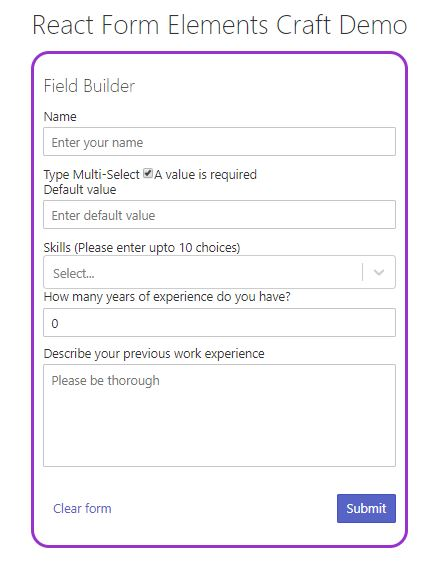

A React Form to allow users to fill a Job Application with different input elements like multiple choice option and select element. The image of the form is displayed here:

What the form can do:

1. The user can add and remove choices from the list of choices. 
2. The following rules of validation are implemented and the user is notified if there are any validation issues.
a. The Label field is required.
b. Duplicates choices are not allowed.
c. There cannot be more than 50 choices total.
3. If the default value is not one of the choices, it is added to the list of choices when the field is saved.
4. A Clear form button is added that allows the user to clear the form and start fresh.
5. The submit button should creates a json object and logs the post data to the console. 

To run:
npm install
npm start
